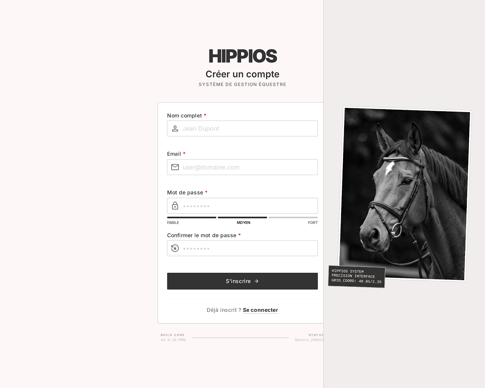

Spec (1) site: Creer user
### **Contexte du projet :**
Notre projet vise à développer une application de suivi équestre permettant aux propriétaires et aux professionnels d’assurer un suivi complet et continu de la santé de leurs chevaux.
L’objectif est d’anticiper les problèmes de santé, réduire les coûts vétérinaires et améliorer le bien-être animal. L’application centralise toutes les informations liées à la santé, l’alimentation et le budget, tout en proposant des recommandations personnalisées et des outils connectés pour un suivi en temps réel.
Cette approche s’inscrit dans une volonté de moderniser la gestion quotidienne du cheval grâce à la data et aux objets connectés.

### **Objectifs de la fonctionnalité :**

Créer un compte utilisateur.

### **Acteurs impliqués :**

Utilisateur

Systeme

### **Fonctionnalité et description détaillée :**

Permet a l’utilisateur de pouvoir se créer un compte.

### **Etapes du flux principal :**

L’utilisateur rempli les informations du formulaire.
le systeme verifie que l’email n’existe pas

Le systeme confirme l’inscription

L’utilisateur est rediriger vers l’authentification

### Scénario alternatifs et exception :

**L'adresse email est déjà associée à un compte existant → un message d'erreur est affiché, l'inscription est bloquée et l'utilisateur est invité à se connecter ou à réinitialiser son mot de passe**

**Un ou plusieurs champs obligatoires ne sont pas remplis → le formulaire ne peut pas être soumis, les champs manquants sont mis en évidence**

**Le format de l'email est invalide → un message d'erreur est affiché sous le champ concerné**

**Les deux champs mot de passe ne correspondent pas → un message d'erreur est affiché, l'envoi est bloqué**

### **Règles de gestion :**

RG-01 : Tous les champs obligatoires doivent être remplis pour soumettre le formulaire
RG-02 : L'adresse email doit respecter un format valide (ex: [user@domaine.com](mailto:user@domaine.com))
RG-03 : L'adresse email doit être unique dans le système
RG-04 : Le mot de passe doit contenir au minimum 8 caractères, dont une majuscule, un chiffre et un caractère spécial
RG-05 : La confirmation du mot de passe doit être identique au mot de passe saisi
RG-06 : Le mot de passe ne doit pas être stocké en clair, il doit être hashé

### **Interface utilisateur :**

Le bouton de soumission est désactivé tant que les champs obligatoires sont vides
Un indicateur de force du mot de passe est affiché en temps réel (faible, moyen, fort)
Les messages d'erreur sont affichés directement sous le champ concerné
Un indicateur de chargement est affiché pendant le traitement de l'inscription
Un lien vers la page de connexion est disponible pour les utilisateurs déjà inscrits

### **UX/UI: **

### **Cas de test pour la validation :**

CT-01 : Inscription réussie avec des informations valides et un email inexistant → compte créé, redirection vers la page de connexion
CT-02 : Tentative d'inscription avec un email déjà existant → message d'erreur affiché, inscription bloquée
CT-03 : Soumission avec un format d'email invalide → message d'erreur sous le champ email
CT-04 : Mot de passe ne respectant pas les critères de sécurité → message d'erreur affiché, envoi bloqué
CT-05 : Les deux champs mot de passe ne correspondent pas → message d'erreur affiché, envoi bloqué
CT-06 : Soumission avec un ou plusieurs champs vides → bouton désactivé ou champs mis en évidence

### **Post-conditions :**

En cas de succès : un nouveau compte utilisateur est créé en base de données, un email de confirmation est envoyé à l'adresse renseignée, et l'utilisateur est redirigé vers la page de connexion
En cas d'échec : aucun compte n'est créé, l'utilisateur reste sur le formulaire d'inscription avec les messages d'erreur appropriés
