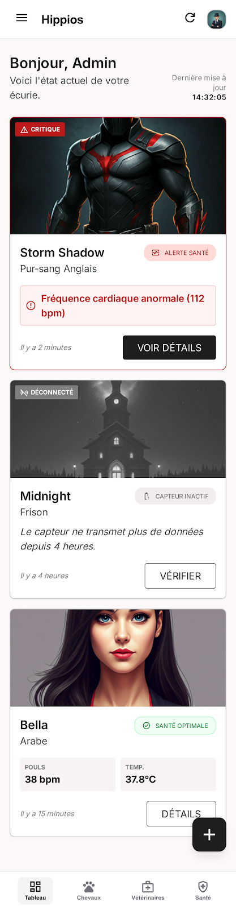

# Spec (13) app: Dashboard “accueil”

### **Contexte du projet :**
Notre projet vise à développer une application de suivi équestre permettant aux propriétaires et aux professionnels d’assurer un suivi complet et continu de la santé de leurs chevaux.
L’objectif est d’anticiper les problèmes de santé, réduire les coûts vétérinaires et améliorer le bien-être animal. L’application centralise toutes les informations liées à la santé, l’alimentation et le budget, tout en proposant des recommandations personnalisées et des outils connectés pour un suivi en temps réel.
Cette approche s’inscrit dans une volonté de moderniser la gestion quotidienne du cheval grâce à la data et aux objets connectés.

### **Objectifs de la fonctionnalité :**

Afficher sur la page d'accueil l'ensemble des chevaux de l'utilisateur, classés par ordre de priorité : en premier les chevaux ayant un problème de santé détecté, en second les chevaux dont le capteur est éteint, et en troisième les chevaux en bonne santé.

### **Acteurs impliqués :**

- Utilisateur
- Système
- Dispositifs physiques

### **Fonctionnalité et description détaillée :**

La page d'accueil constitue le point d'entrée principal de l'application. Elle affiche la liste complète des chevaux enregistrés par l'utilisateur, triée automatiquement selon un ordre de priorité basé sur l'état de santé et le statut du capteur associé à chaque cheval. Chaque carte cheval présente un résumé visuel de son état permettant à l'utilisateur d'identifier rapidement les situations nécessitant une attention particulière. Un accès rapide à la fiche détaillée de chaque cheval est disponible depuis cette vue.

### **Etapes du flux principal :**

L'utilisateur ouvre l'application et accède à la page d'accueil
Le système récupère la liste des chevaux de l'utilisateur
Le système récupère le statut en temps réel de chaque capteur associé
Le système récupère les éventuelles alertes de santé détectées pour chaque cheval
Le système trie et affiche les chevaux selon l'ordre de priorité défini
L'utilisateur visualise l'état de l'ensemble de ses chevaux en un coup d'œil
L'utilisateur peut cliquer sur un cheval pour accéder à sa fiche détaillée

### Scénario alternatifs et exception :

Aucun cheval n'est enregistré → un message informatif invite l'utilisateur à ajouter son premier cheval
Aucun capteur n'est associé à un cheval → le cheval est affiché dans la catégorie "bonne santé" sans indicateur de statut capteur
Plusieurs chevaux ont une alerte de santé simultanément → ils sont tous affichés en priorité 1, triés par ordre d'apparition de l'alerte (la plus récente en premier)
La récupération des données du capteur échoue (erreur réseau) → un indicateur d'erreur de connexion est affiché sur la carte du cheval concerné, les dernières données connues sont affichées
Le capteur d'un cheval vient de se rallumer → la carte est automatiquement repositionnée dans la catégorie correspondante

### **Règles de gestion :**

RG-01 : L'utilisateur doit être authentifié pour accéder au dashboard
RG-02 : L'ordre de priorité d'affichage est le suivant : (1) cheval avec problème de santé détecté, (2) cheval avec capteur éteint, (3) cheval en bonne santé
RG-03 : Au sein d'une même catégorie de priorité, les chevaux sont triés par ordre d'apparition de l'événement le plus récent
RG-04 : Un cheval sans capteur associé est classé en priorité 3 (bonne santé) par défaut
RG-05 : Les données affichées sur le dashboard sont actualisées automatiquement à intervalle régulier pour refléter l'état en temps réel
RG-06 : Une alerte de santé reste affichée en priorité 1 jusqu'à ce qu'elle soit explicitement acquittée ou résolue
RG-07 : Le statut "capteur éteint" est déclenché après une durée d'inactivité définie du dispositif

### **Interface utilisateur :**

Chaque cheval est représenté par une carte affichant : sa photo, son nom, sa race et un indicateur visuel de son état
Les cartes en priorité 1 (problème de santé) sont affichées avec un indicateur rouge et une icône d'alerte
Les cartes en priorité 2 (capteur éteint) sont affichées avec un indicateur gris et une icône de capteur inactif
Les cartes en priorité 3 (bonne santé) sont affichées avec un indicateur vert
Un badge ou label indique clairement la nature de l'alerte sur les cartes en priorité 1 (ex : "Fréquence cardiaque anormale")
Un indicateur de dernière mise à jour est affiché sur chaque carte pour informer de la fraîcheur des données
Un bouton de rafraîchissement manuel est disponible pour forcer la mise à jour des données
Un accès rapide au bouton "Ajouter un cheval" est disponible depuis le dashboard

### **Cas de test pour la validation :**

CT-01 : Cheval avec alerte de santé active → carte affichée en premier avec indicateur rouge et détail de l'alerte
CT-02 : Cheval avec capteur éteint → carte affichée en second avec indicateur gris et icône capteur inactif
CT-03 : Cheval en bonne santé → carte affichée en dernier avec indicateur vert
CT-04 : Plusieurs chevaux en alerte simultanément → tous affichés en priorité 1, triés par alerte la plus récente
CT-05 : Cheval sans capteur associé → affiché en priorité 3 sans indicateur de statut capteur
CT-06 : Résolution d'une alerte de santé → carte repositionnée automatiquement dans la catégorie correspondante
CT-07 : Capteur qui se rallume → carte repositionnée automatiquement de la priorité 2 vers la priorité 3
CT-08 : Aucun cheval enregistré → message d'invitation à ajouter un cheval affiché
CT-09 : Erreur de récupération des données capteur → indicateur d'erreur affiché sur la carte, dernières données connues conservées
CT-10 : Vérification que l'utilisateur ne voit pas les chevaux appartenant à un autre compte
CT-11 : Clic sur une carte cheval → redirection vers la fiche détaillée du cheval

### **UX/UI :**

### **Post-conditions :**

En cas de chargement réussi : les chevaux sont affichés triés selon l'ordre de priorité défini avec leurs statuts à jour
En cas d'alerte détectée : le cheval concerné est remonté en priorité 1 et l'alerte est visible immédiatement sur le dashboard
En cas d'erreur de chargement : un message d'erreur est affiché et les dernières données connues sont conservées à l'écran
