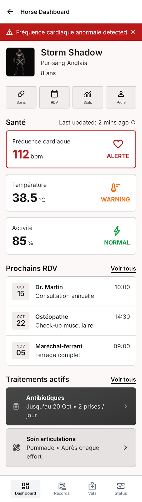

# Spec (14) app: Dashboard un cheval

### **Contexte du projet :**
Notre projet vise à développer une application de suivi équestre permettant aux propriétaires et aux professionnels d’assurer un suivi complet et continu de la santé de leurs chevaux.
L’objectif est d’anticiper les problèmes de santé, réduire les coûts vétérinaires et améliorer le bien-être animal. L’application centralise toutes les informations liées à la santé, l’alimentation et le budget, tout en proposant des recommandations personnalisées et des outils connectés pour un suivi en temps réel.
Cette approche s’inscrit dans une volonté de moderniser la gestion quotidienne du cheval grâce à la data et aux objets connectés.

### **Objectifs de la fonctionnalité :**

Permettre à l'utilisateur de consulter en un coup d'œil les informations essentielles d'un cheval : ses métriques de santé simplifiées issues du capteur, ses prochains rendez-vous vétérinaires et ses traitements en cours.

### **Acteurs impliqués :**

- Utilisateur
- Système
- Dispositif physique

### **Fonctionnalité et description détaillée :**

La page dashboard d'un cheval centralise les informations les plus importantes en une vue unique et lisible. Les métriques de santé transmises par le capteur (fréquence cardiaque, température, etc.) sont affichées de manière simplifiée et visuelle. Les prochains rendez-vous à venir sont listés avec leur date et les informations du vétérinaire associé. Les traitements en cours sont affichés avec leur nom et leur date de fin. Chaque section dispose d'un accès rapide vers le module correspondant pour consulter le détail ou effectuer des actions.

### **Etapes du flux principal :**

L'utilisateur accède à la fiche d'un cheval depuis le dashboard d'accueil ou la liste des chevaux
Le système récupère les dernières métriques de santé transmises par le capteur associé
Le système récupère les prochains rendez-vous à venir pour ce cheval
Le système récupère les traitements en cours pour ce cheval
Le système affiche l'ensemble des informations sur la page dashboard du cheval
L'utilisateur consulte les informations et peut naviguer vers les modules détaillés via les raccourcis disponibles

### Scénario alternatifs et exception :

Aucun capteur n'est associé au cheval → la section métriques affiche un message invitant l'utilisateur à associer un dispositif
Le capteur est éteint ou injoignable → la section métriques affiche les dernières données connues avec la date de dernière mise à jour et un indicateur d'inactivité
Aucun rendez-vous à venir n'est planifié → la section rendez-vous affiche un message informatif avec un raccourci vers l'agenda pour en créer un
Aucun traitement en cours → la section traitements affiche un message informatif avec un raccourci vers le module traitements
Une alerte de santé est détectée sur une métrique → la métrique concernée est mise en évidence visuellement avec un indicateur d'alerte
La récupération des données échoue (erreur réseau) → un message d'erreur est affiché dans la section concernée, les autres sections restent fonctionnelles

### **Règles de gestion :**

RG-01 : L'utilisateur doit être authentifié pour accéder à cette page
RG-02 : L'utilisateur ne peut consulter que les dashboards des chevaux lui appartenant
RG-03 : Les métriques affichées sont les dernières valeurs transmises par le capteur associé au cheval
RG-04 : Les métriques sont présentées de manière simplifiée avec un indicateur visuel (vert / orange / rouge) selon les seuils de normalité définis
RG-05 : Seuls les rendez-vous à venir (date supérieure ou égale à aujourd'hui) sont affichés, limités aux 3 prochains
RG-06 : Seuls les traitements dont la date de fin est supérieure ou égale à aujourd'hui sont considérés comme en cours
RG-07 : Les données affichées sont actualisées automatiquement à intervalle régulier
RG-08 : En cas d'alerte active sur une métrique, un bandeau d'alerte est affiché en haut de la page

### **Interface utilisateur :**

Un en-tête affiche la photo du cheval, son nom, sa race et son âge
Un bandeau d'alerte rouge est affiché en haut de page si une alerte de santé est active
La section métriques affiche chaque indicateur de santé sous forme de carte simplifiée avec une valeur, une unité et un indicateur coloré (vert / orange / rouge)
La section rendez-vous affiche les 3 prochains rendez-vous avec la date, l'heure et le nom du vétérinaire, ainsi qu'un lien "Voir tous les rendez-vous"
La section traitements affiche les traitements en cours avec le nom du traitement et sa date de fin, ainsi qu'un lien "Voir tous les traitements"
Chaque section dispose d'un bouton d'accès rapide vers le module complet correspondant
Un indicateur de dernière mise à jour est affiché dans la section métriques
Un bouton de rafraîchissement manuel est disponible pour forcer la mise à jour des données
Les sections sans données affichent un message informatif avec un raccourci vers l'action correspondante

### **Cas de test pour la validation :**

CT-01 : Cheval avec capteur actif et données récentes → métriques affichées avec indicateurs colorés corrects
CT-02 : Métrique hors seuil de normalité → indicateur rouge affiché sur la métrique concernée et bandeau d'alerte en haut de page
CT-03 : Capteur éteint → section métriques affiche les dernières données connues avec indicateur d'inactivité et date de dernière mise à jour
CT-04 : Aucun capteur associé → message d'invitation à associer un dispositif affiché dans la section métriques
CT-05 : Rendez-vous à venir existants → les 3 prochains sont affichés avec date, heure et nom du vétérinaire
CT-06 : Aucun rendez-vous à venir → message informatif affiché avec raccourci vers l'agenda
CT-07 : Traitements en cours existants → affichés avec nom et date de fin
CT-08 : Aucun traitement en cours → message informatif affiché avec raccourci vers le module traitements
CT-09 : Erreur de récupération des métriques → message d'erreur dans la section métriques, sections rendez-vous et traitements non affectées
CT-10 : Rafraîchissement manuel → données mises à jour et affichage actualisé
CT-11 : Clic sur "Voir tous les rendez-vous" → redirection vers l'agenda du cheval
CT-12 : Tentative d'accès au dashboard d'un cheval appartenant à un autre utilisateur → accès refusé

### **UX/UI :**

### **Post-conditions :**

En cas de chargement réussi : toutes les sections sont affichées avec les données à jour du cheval
En cas d'alerte active : le bandeau d'alerte est visible et la métrique concernée est mise en évidence
En cas d'erreur partielle : les sections non affectées restent fonctionnelles et un message d'erreur est affiché uniquement dans la section concernée
