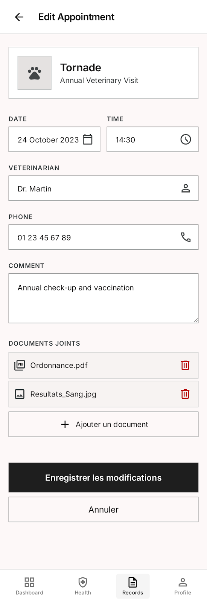
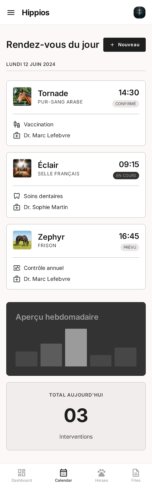

# Spec : Modifier un rendez-vous

### **Contexte du projet :**
Notre projet vise à développer une application de suivi équestre permettant aux propriétaires et aux professionnels d’assurer un suivi complet et continu de la santé de leurs chevaux. (Voir le README principal pour plus de détails).

### **Objectifs de la fonctionnalité :**
Permettre à l'utilisateur de modifier les informations d'un rendez-vous vétérinaire à venir (date, heure, informations du vétérinaire, commentaire, documents joints).

### **Acteurs impliqués :**
- Utilisateur (propriétaire de l'animal)
- Système

### **Fonctionnalité et description détaillée :**
Permet à l'utilisateur authentifié et abonné de modifier un rendez-vous à venir depuis sa fiche détail. Le formulaire est pré-rempli avec les informations actuelles. Les rendez-vous passés ne sont pas modifiables afin de garantir l'intégrité de l'historique médical.

### **Etapes du flux principal :**
1. L'utilisateur accède à la fiche détail d'un rendez-vous à venir
2. L'utilisateur clique sur "Modifier"
3. Le système affiche le formulaire pré-rempli avec les informations actuelles
4. L'utilisateur modifie les champs souhaités
5. L'utilisateur peut ajouter ou supprimer des documents joints
6. L'utilisateur soumet le formulaire
7. Le système valide les données
8. Le système enregistre les modifications en base de données
9. La fiche mise à jour est affichée et le calendrier est actualisé

### **Scénarios alternatifs et exceptions :**
- Un champ obligatoire est vidé lors de la modification → le formulaire ne peut pas être soumis, les champs manquants sont mis en évidence
- Un nouveau document joint dépasse la taille maximale → un message d'erreur est affiché, l'ancien document est conservé
- Un nouveau document joint est dans un format non supporté → un message d'erreur est affiché
- L'utilisateur annule la modification → aucune donnée n'est modifiée, retour à la fiche du rendez-vous
- L'utilisateur tente de modifier un rendez-vous passé → le bouton "Modifier" n'est pas disponible, la fiche est en lecture seule

### **Règles de gestion :**
- RG-01 : L'utilisateur doit être authentifié et abonné pour accéder à cette fonctionnalité
- RG-02 : Seuls les rendez-vous à venir peuvent être modifiés
- RG-03 : Les champs date, heure et nom du vétérinaire restent obligatoires lors de la modification
- RG-04 : Le numéro de téléphone doit respecter un format valide s'il est renseigné
- RG-05 : Les documents joints doivent être au format PDF, JPG ou PNG
- RG-06 : La taille maximale par document joint est de 10 Mo
- RG-07 : L'utilisateur ne peut modifier que les rendez-vous rattachés à ses propres animaux

### **Interface utilisateur :**
- Le bouton "Modifier" est visible uniquement sur les rendez-vous à venir
- Le formulaire est pré-rempli avec les informations actuelles du rendez-vous
- Les documents joints existants sont listés avec la possibilité de les supprimer individuellement
- Un bouton permet d'ajouter de nouveaux documents
- Les messages d'erreur sont affichés directement sous le champ concerné
- Un bouton "Annuler" permet de revenir à la fiche sans enregistrer

### **Cas de test pour la validation :**
- CT-01 : Modification réussie avec des données valides → modifications enregistrées, fiche et calendrier mis à jour
- CT-02 : Tentative de soumission avec un champ obligatoire vide → formulaire non soumis, champ mis en évidence
- CT-03 : Ajout d'un nouveau document valide → document joint et accessible depuis la fiche
- CT-04 : Ajout d'un document dépassant 10 Mo → message d'erreur affiché, ancien document conservé
- CT-05 : Suppression d'un document joint existant → document retiré de la fiche après confirmation
- CT-06 : Annulation de la modification → aucune donnée modifiée, retour à la fiche
- CT-07 : Tentative de modification d'un rendez-vous passé → bouton "Modifier" absent, fiche en lecture seule

### **UX/UI :**

### **Post-conditions :**
- En cas de succès : les nouvelles informations sont enregistrées en base de données, la fiche et le calendrier sont mis à jour
- En cas d'échec : aucune donnée n'est modifiée, l'utilisateur reste sur le formulaire avec les messages d'erreur appropriés
