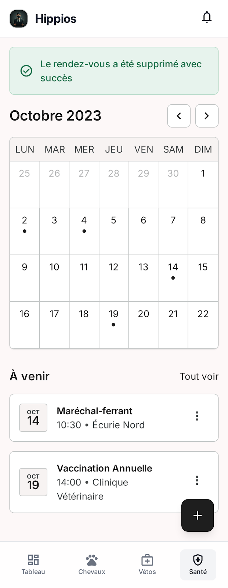

# Spec : Supprimer un rendez-vous

### **Contexte du projet :**
Notre projet vise à développer une application de suivi équestre permettant aux propriétaires et aux professionnels d’assurer un suivi complet et continu de la santé de leurs chevaux. (Voir le README principal pour plus de détails).

### **Objectifs de la fonctionnalité :**
Permettre à l'utilisateur de supprimer définitivement un rendez-vous vétérinaire et l'ensemble des documents associés, après confirmation explicite.

### **Acteurs impliqués :**
- Utilisateur (propriétaire de l'animal)
- Système

### **Fonctionnalité et description détaillée :**
Permet à l'utilisateur authentifié et abonné de supprimer un rendez-vous depuis sa fiche détail. La suppression est irréversible et entraîne la suppression en cascade de tous les documents joints. Une modale de confirmation est affichée avant toute suppression pour éviter les actions accidentelles.

### **Etapes du flux principal :**
1. L'utilisateur accède à la fiche détail d'un rendez-vous
2. L'utilisateur clique sur "Supprimer"
3. Le système affiche une modale de confirmation avertissant que l'action est irréversible et que les documents associés seront supprimés
4. L'utilisateur confirme la suppression
5. Le système supprime le rendez-vous et tous les documents associés en base de données
6. L'utilisateur est redirigé vers la vue mensuelle de l'agenda
7. Le calendrier est mis à jour, le jour n'est plus mis en évidence si aucun autre rendez-vous n'existe ce jour

### **Scénarios alternatifs et exceptions :**
- L'utilisateur annule depuis la modale de confirmation → aucune action effectuée, retour à la fiche du rendez-vous
- Une erreur survient lors de la suppression → un message d'erreur est affiché, aucune donnée n'est supprimée

### **Règles de gestion :**
- RG-01 : L'utilisateur doit être authentifié et abonné pour accéder à cette fonctionnalité
- RG-02 : L'utilisateur ne peut supprimer que les rendez-vous rattachés à ses propres animaux
- RG-03 : Une confirmation explicite est obligatoire avant toute suppression
- RG-04 : La suppression est irréversible, aucune restauration n'est possible
- RG-05 : La suppression d'un rendez-vous entraîne la suppression en cascade de tous les documents qui y sont associés
- RG-06 : La suppression est une opération atomique : soit tout est supprimé, soit rien ne l'est en cas d'erreur

### **Interface utilisateur :**
- Le bouton "Supprimer" est disponible depuis la fiche détail du rendez-vous, affiché en rouge
- Une modale de confirmation précise que l'action est irréversible et que les documents associés seront supprimés
- Un bouton "Annuler" est disponible dans la modale pour abandonner l'action
- Un indicateur de chargement est affiché pendant le traitement de la suppression
- Le calendrier est mis à jour après suppression réussie

### **Cas de test pour la validation :**
- CT-01 : Suppression réussie après confirmation → rendez-vous et documents associés supprimés, calendrier mis à jour
- CT-02 : Annulation depuis la modale → aucune donnée supprimée, retour à la fiche
- CT-03 : Vérification post-suppression que tous les documents associés sont bien supprimés
- CT-04 : Simulation d'une erreur base de données → message d'erreur affiché, aucune donnée supprimée
- CT-05 : Vérification qu'un utilisateur ne peut pas supprimer un rendez-vous appartenant à un autre utilisateur

### **UX/UI**

### **Post-conditions :**
- En cas de succès : le rendez-vous et tous ses documents associés sont définitivement supprimés de la base de données, le calendrier est mis à jour
- En cas d'échec : aucune donnée n'est supprimée grâce à l'opération atomique, l'utilisateur reste sur la fiche avec un message d'erreur
