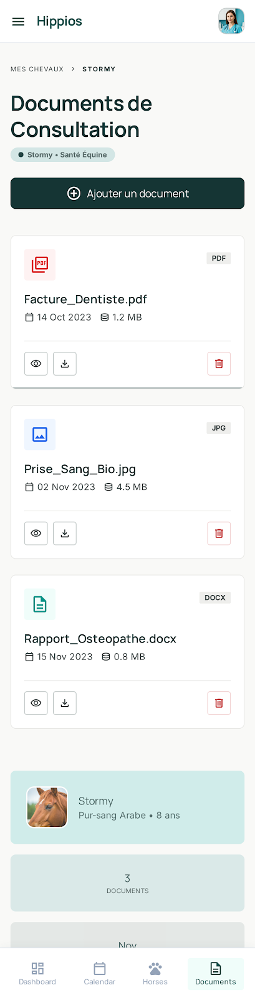

# Spec app : Téléchargement des docs

### **Contexte du projet :**
Notre projet vise à développer une application de suivi équestre permettant aux propriétaires et aux professionnels d’assurer un suivi complet et continu de la santé de leurs chevaux. (Voir le README principal pour plus de détails).

### **Objectifs de la fonctionnalité :**
L'utilisateur peut à tout moment consulter la liste des documents associés à une consultation, les prévisualiser et les télécharger.

### **Acteurs impliqués :**
- Utilisateur — initie l'upload et consulte la liste des pièces jointes
- Système — valide, convertit et persiste les fichiers
- Base de données — stocke les fichiers (BLOB/base64) et leurs métadonnées

### **Fonctionnalité et description détaillée :**
Permet à l'utilisateur d'uploader, consulter, télécharger et prévisualiser les documents liés à une consultation.

### **Etapes du flux principal :**
1. L'utilisateur accède à une fiche de consultation médicale
2. L'utilisateur clique sur "Ajouter un document"
3. Le système affiche un sélecteur de fichier
4. L'utilisateur sélectionne un ou plusieurs fichiers depuis son appareil
5. Le système vérifie le format et la taille des fichiers (RG-02, RG-03)
6. Le système convertit le fichier et enregistre les données binaires + métadonnées en BDD
7. Le document apparaît dans la liste des pièces jointes avec ses informations

### **Scénario alternatifs et exception :**
- Fichier > 5 Mo → message d'erreur affiché, le fichier n'est pas enregistré
- Format non supporté → message d'erreur sous le champ, l'enregistrement est bloqué
- Erreur BDD ou coupure réseau → message d'erreur, l'utilisateur est invité à réessayer, aucune donnée enregistrée
- L'utilisateur supprime un document → modale de confirmation, puis suppression définitive en BDD
- L'utilisateur annule → aucune modification effectuée
- Aucun document associé → message informatif invitant l'utilisateur à en ajouter un

### **Règles de gestion :**
- RG-01: Authentification. L'utilisateur doit être authentifié pour accéder à cette fonctionnalité
- RG-02: Formats acceptés. PDF, JPG, JPEG et PNG uniquement
- RG-03: Taille maximale. 5 Mo par fichier afin de ne pas surcharger la base de données
- RG-04: Multi-documents. Plusieurs documents peuvent être associés à une même consultation
- RG-05: Accès restreint. Les documents sont accessibles uniquement par le propriétaire du compte
- RG-06: Format de stockage. Le fichier est stocké en BDD sous forme de données binaires (BLOB) ou encodé en base64
- RG-07: Métadonnées. Nom original, type MIME, taille et date d'upload enregistrés alongside le fichier
- RG-08: Suppression irréversible. La suppression d'un document entraîne la suppression définitive de l'entrée en BDD
- RG-09: Cascade. La suppression d'une consultation entraîne la suppression automatique de tous ses documents associés

### **Interface utilisateur :**
- Bouton "Ajouter un document" accessible depuis la fiche de consultation
- Liste des documents affichant : nom, type, taille et date d'upload
- Barre de progression affichée pendant l'enregistrement en base de données
- Messages d'erreur affichés clairement sous le champ d'upload en cas de problème
- Bouton de suppression avec modale de confirmation pour chaque document

### **Cas de test pour la validation :**
- CT-01 : Upload d'un fichier PDF valide et sous la limite de taille → Document enregistré en BDD, visible dans la liste avec ses métadonnées
- CT-03 : Upload d'un fichier dépassant 5 Mo → Message d'erreur affiché, document non enregistré
- CT-04 : Upload d'un fichier dans un format non supporté (.docx, .mp4) → Message d'erreur affiché, upload bloqué
- CT-06 : Suppression d'un document après confirmation → Entrée supprimée de la BDD, document retiré de la liste
- CT-07 : Annulation de la suppression depuis la modale → Aucune modification effectuée
- CT-08 : Simulation d'une erreur BDD pendant l'upload → Message d'erreur affiché, aucune donnée enregistrée
- CT-09 : Suppression d'une consultation → Tous les documents associés sont supprimés en cascade
- CT-10 : Accès aux documents d'un autre utilisateur → Accès refusé - documents non accessibles

### **UX/UI**

### **Post-conditions :**
- Upload réussi : Le fichier et ses métadonnées sont enregistrés en base de données. Le document apparaît dans la liste de la consultation
- Suppression réussie : L'entrée est définitivement supprimée de la base de données. Le document disparaît de la liste
- Échec : Aucune donnée n'est enregistrée en base de données. L'utilisateur est informé de l'erreur et invité à réessayer
